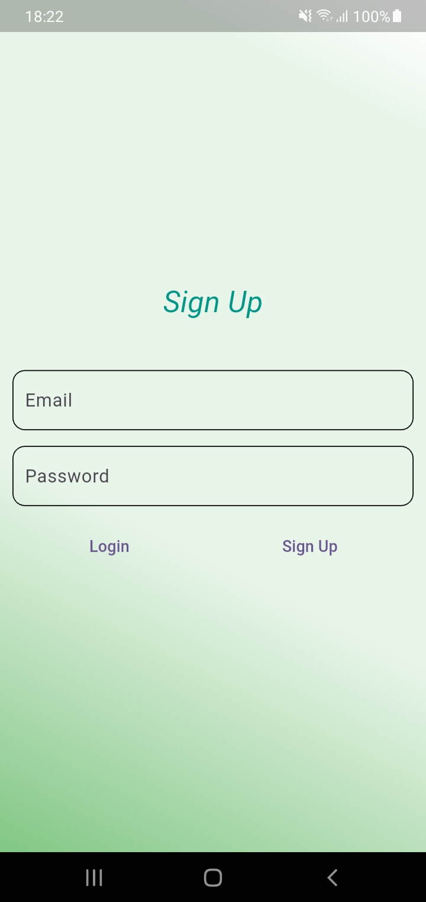

# Firebase Tutorial

A new Flutter project.

## Getting Started

This project is a starting point for a Flutter application.

A few resources to get you started if this is your first Flutter project:

## screenshots
<div>
.
.
.
.
.
</div>


## Steps:
1. pub get 
     ```
      firebase_auth: ^5.4.2
      firebase_core: ^3.11.0
     ```
2. initialise the app in main
     ```
     await Firebase.initializeApp(
        options: DefaultFirebaseOptions.currentPlatform,
      );
     ```
3. Controller... setup and form validators
4. StreamBuilder... the asynchronous checking for sign in or home page.... can also user iDTokenChanges..
    ``` 
   StreamBuilder(
           stream: FirebaseAuth.instance.authStateChanges(),
           builder: (context, snapshot) {
             if (snapshot.connectionState == ConnectionState.waiting) {
               return Center(
                 child: CircularProgressIndicator(),
               );
             }
             if (snapshot.data != null) {
               return HomeScreen();
             }
             return SignUpScreen();
           },
         ),
   ```
5. - create database...
   - select fire store database
   - select location, it will not be modifiable in later...
   - create collection...

6.   add dependencies
      
      ```
      cloud_firestore: ^5.6.3
      ```
7.   create method to upload data....
8.   note.. firebase automatically creates the collection
9.   The method
   ```
   FirebaseFirestore.instance.collection('person').get();
   ``` 
   gives the ```Future<QuerySnapshot<Map<String, dynamic>>>``` value, need to restart the app for latest edit or new data
   but ```FirebaseFirestore.instance.collection('person').snapshots();``` this return the  ```Stream<QuerySnapshot<Map<String, dynamic>>>``` value which is sync to view, means it get auto updated
   also can filter the query or we can say conditional query with ``` final data = FirebaseFirestore.instance.collection('person').where('uid',isEqualTo: FirebaseAuth.instance.currentUser!.uid).snapshots();```

10. use ```firebase_storage: ^12.4.2``` for storing the images or files/ audios...

- [Lab: Write your first Flutter app](https://docs.flutter.dev/get-started/codelab)
- [Cookbook: Useful Flutter samples](https://docs.flutter.dev/cookbook)

For help getting started with Flutter development, view the
[online documentation](https://docs.flutter.dev/), which offers tutorials,
samples, guidance on mobile development, and a full API reference.

## 🛠 Features

- FCM token generation
- Foreground notification handling
- Background and terminated notification handling
- Local display of FCM messages with full customization
- Android and iOS support

---

## 📦 Packages Used

- [`firebase_messaging`](https://pub.dev/packages/firebase_messaging)
- [`flutter_local_notifications`](https://pub.dev/packages/flutter_local_notifications)

---

## 📁 File: `notification_service.dart`

This file defines the `NotificationService` class and the Firebase messaging background handler.

### 🔧 Initialization Flow

1. Requests notification permissions
2. Sets up local notification channels
3. Initializes FCM background and foreground message listeners
4. Displays FCM messages using `flutter_local_notifications`

---

## 🔑 Setup Instructions

### 1. Firebase Configuration

- Add Firebase to your Flutter project using [official docs](https://firebase.flutter.dev/docs/overview).
- Add `google-services.json` (Android) and `GoogleService-Info.plist` (iOS).

### 2. Android Setup

- Add permission in `AndroidManifest.xml`:
```xml
<uses-permission android:name="android.permission.POST_NOTIFICATIONS"/>

